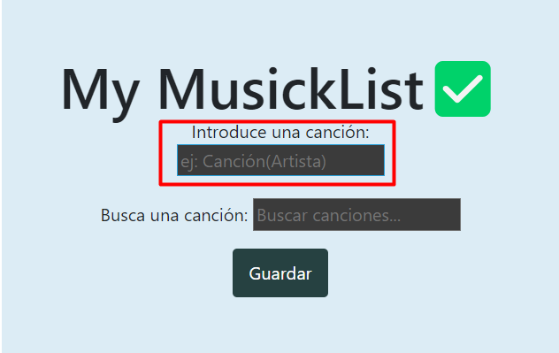

# PROYECTO LISTA DWEC - PEDRO ÁNGEL SERRANO RODRIGUES

## Descripción y funcionalidades del proyecto

En este proyecto yo me he encargado de hacer una lista de canciones en la cual el usuario pone las canciones que tiene que escuchar y he tenido que meter las funcionalidades que se me pedían en los requisitos

## Características

- Añadir canciones

- Eliminar canciones

- Tachar las canciones que hayas escuchado

- Editar la canción en caso de error desde la misma página 

- Guardar tu lista de canciones dentro del almacenamiento local

- Búsqueda de canciones sin necesidad de pulsar intro(busqueda dinámica)

## Manual de uso

-`Añadir canción`



Solo se tendrá que escribir el nombre de la canción y pulsar la tecla 'Enter'

- [@vitejs/plugin-react-swc](https://github.com/vitejs/vite-plugin-react-swc) uses [SWC](https://swc.rs/) for Fast Refresh


If you are developing a production application, we recommend updating the configuration to enable type aware lint rules:

- Configure the top-level `parserOptions` property like this:

```js
   parserOptions: {
    ecmaVersion: 'latest',
    sourceType: 'module',
    project: ['./tsconfig.json', './tsconfig.node.json'],
    tsconfigRootDir: __dirname,
   },
```

- Replace `plugin:@typescript-eslint/recommended` to `plugin:@typescript-eslint/recommended-type-checked` or `plugin:@typescript-eslint/strict-type-checked`
- Optionally add `plugin:@typescript-eslint/stylistic-type-checked`
- Install [eslint-plugin-react](https://github.com/jsx-eslint/eslint-plugin-react) and add `plugin:react/recommended` & `plugin:react/jsx-runtime` to the `extends` list
